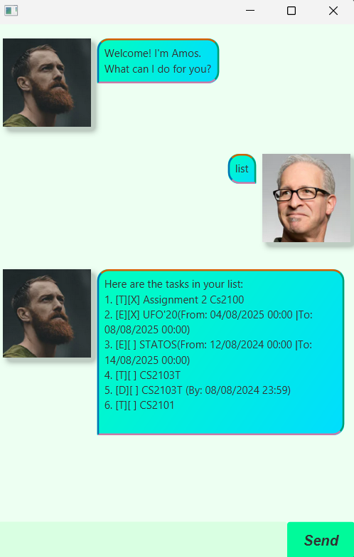

# Amos User Guide

Amos is a Java-based task management application that helps users manage their todos, deadlines, and events efficiently. It supports command-line interaction and provides features such as task tracking, duplicate detection, and search.

---
## Features Overview

| Feature                | Description                                      |
|------------------------|--------------------------------------------------|
| Todos                  | Add simple tasks with descriptions              |
| Deadlines              | Tasks with a due date and time                  |
| Events                 | Tasks with start and end times                  |
| Mark/Unmark            | Mark tasks as done or undone                    |
| Delete                 | Remove tasks by index                            |
| Find                   | Search tasks by keyword                          |
| Duplicate Detection    | Prevents adding duplicate tasks                |
---
## Adding Todos

**Action:** Add a new Todo task with a description.

**Example:**
todo Read book

**Expected Outcome:**  
A new Todo task with the description "Read book" is added to the task list. The system displays a confirmation message with the current total number of tasks.

---

## Adding Deadlines

**Action:** Add a Deadline task with a due date and time.

**Example:**
deadline Submit report|By: 05/09/2025 23:59

**Expected Outcome:**  
A new Deadline task is added with the description "Submit report" and due date "05/09/2025 23:59". The system confirms the addition.

---

## Adding Events

**Action:** Add an Event task with start and end times.

**Example:**
event Team meeting|From:05/09/2025 10:00|To:05/09/2025 12:00

**Expected Outcome:**  
The Event task "Team meeting" with specified start and end times is added. Confirmation displays the task and updated total count.

---

## Marking and Unmarking Tasks

Mark or unmark a task as done by index.

**Example:**  
mark 2 or unmark 2

**Expected Outcome:**  
The task at index 2 is marked done or undone. Confirmation displays the task status.

---

## Deleting Tasks

Delete a task by index.

**Example:**
delete 1

**Expected Outcome:**  
The task at index 1 is removed. Confirmation displays the removed task and current total count.

---

## Finding Tasks

Search for tasks by keyword.

**Example:**
find book

**Expected Outcome:**  
Displays all tasks containing the keyword "book".

---

## Duplicate Detection

Prevent adding duplicate tasks.

**Rules:**
- Todos: Duplicate if description matches an existing Todo.
- Deadlines: Duplicate if description and due date match.
- Events: Duplicate if description, start time, and end time match.

**Example:**  
todo Read book 
todo Read book

**Expected Outcome:**  
The second "Read book" triggers a duplicate warning and is not added.

